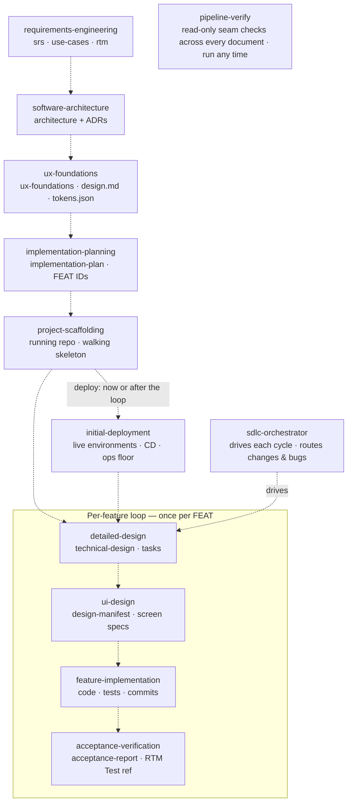

# Agentic SDLC Kit

A pipeline of twelve [Agent Skills](https://agentskills.io) that carry a software
project from *"I have an idea"* to a **deployed, verified, maintainable system** —
requirements, architecture, UX, plan, repo, deployment, and then a per-feature
build loop that runs for the life of the project.

They follow the open `SKILL.md` standard, so they work in Claude Code and in any
other agent that loads skills (Cursor, GitHub Copilot, and others the
[`skills`](https://www.skills.sh) CLI supports).

**What makes this a kit and not twelve prompts:** the skills share one vocabulary
and hand real artifacts to each other. A requirement minted as `FR-AUTH-007` in
the SRS is the same ID the architecture cites, the plan schedules into `FEAT-004`,
the feature design turns into acceptance criteria, the implementation satisfies,
and the auditor signs off in the traceability matrix. Nothing is re-decided
downstream, and no skill invents an ID it can't resolve.

---

## Contents

- [Why this exists](#why-this-exists)
- [The pipeline at a glance](#the-pipeline-at-a-glance)
- [Install](#install)
- [Running the pipeline end to end](#running-the-pipeline-end-to-end)
- [What lands on disk](#what-lands-on-disk)
- [How twelve skills stay one system](#how-twelve-skills-stay-one-system)
- **The skills**
  - [Requirements Engineering](#requirements-engineering)
  - [Software Architecture](#software-architecture)
  - [UX Foundations](#ux-foundations)
  - [Implementation Planning](#implementation-planning)
  - [Project Scaffolding](#project-scaffolding)
  - [Initial Deployment](#initial-deployment)
  - [Detailed Design](#detailed-design)
  - [UI Design](#ui-design)
  - [Feature Implementation](#feature-implementation)
  - [Acceptance Verification](#acceptance-verification)
  - [SDLC Orchestrator](#sdlc-orchestrator)
  - [Pipeline Verify](#pipeline-verify)
- [Using a skill standalone](#using-a-skill-standalone)
- [Right-sizing: do I need all twelve?](#right-sizing-do-i-need-all-twelve)
- [Contributing](#contributing)
- [License](#license)

---

## Why this exists

Coding agents are good at writing code and bad at knowing *what* to write, *in
what order*, and *whether it's actually done*. Left to itself, an agent
improvises: it redesigns mid-build, weakens a failing test until it passes,
loses its place between sessions, and ships something that satisfies the last
message in the chat rather than the requirement.

This kit answers that with process, not vibes:

- **Every stage has one job and one output.** The stage that decides is not the
  stage that builds; the stage that builds is not the stage that verifies.
- **Decisions are made once, at the level that owns them.** The stack is chosen
  in the architecture and never relitigated downstream. The test frameworks and
  coverage stance are chosen there too, and everything downstream *realizes*
  them.
- **Position is computed from artifacts, never remembered.** Any session can
  start cold, read the repo, and know exactly where the project is. That's what
  makes the loop survivable across context windows.
- **Divergence escalates instead of forking.** When reality contradicts the
  design, the skill either implements the design's intent or files an amendment
  against the owning document — it never quietly changes the spec.
- **Green is demonstrated, not asserted.** Done-whens are executed. Suites are
  re-run cold by an independent auditor. Tests, and coverage gates, are never
  loosened to pass.

---

## The pipeline at a glance


<!--
Diagram source, kept for maintenance. Not rendered.
NOTE: arrows are written dotted (-.->) on purpose — an HTML comment closes at the
first solid arrow, which would leak this block onto the page. Swap the dotted
arrows for solid ones (and |label| back to -- label --) when reusing this source.

-->

**The linear phase — runs once, in this order:**

`requirements-engineering` → `software-architecture` → `ux-foundations` →
`implementation-planning` → `project-scaffolding` →
*(`initial-deployment` — here, or any time later)*

**The loop — runs once per feature, in this order, for the life of the project:**

`detailed-design` → `ui-design` → `feature-implementation` → `acceptance-verification` → next feature

**Above and across:** `sdlc-orchestrator` drives that loop and routes change
requests and bugs; `pipeline-verify` checks the seams between documents whenever
you want a health check.

| # | Skill | Kind | Consumes | Produces |
| :- | :---- | :--- | :------- | :------- |
| 1 | [`requirements-engineering`](#requirements-engineering) | one-pass | you (interview) | `docs/srs.md`, `docs/use-cases.md`, `docs/rtm.md` |
| 2 | [`software-architecture`](#software-architecture) | one-pass | SRS, use cases | `docs/architecture.md` (+ ADRs) · RTM **Design ref** |
| 3 | [`ux-foundations`](#ux-foundations) | one-pass | SRS, architecture, use cases | `docs/ux-foundations.md`, `docs/design.md`, `docs/tokens.json` |
| 4 | [`implementation-planning`](#implementation-planning) | one-pass | SRS, use cases, architecture, UX | `docs/implementation-plan.md` (FEAT IDs) · RTM **Plan ref** |
| 5 | [`project-scaffolding`](#project-scaffolding) | one-pass | architecture, plan, UX trio, SRS | **a running repo** + `docs/scaffold-notes.md` |
| 6 | [`initial-deployment`](#initial-deployment) | one-pass · any time after scaffolding | architecture, repo deploy artifacts, scaffold notes | **a live system** + `docs/deployment-notes.md` |
| 7 | [`detailed-design`](#detailed-design) | loop | plan, SRS, use cases, architecture, **the codebase** | `technical-design.md`, `tasks.md` · RTM **Design ref** |
| 8 | [`ui-design`](#ui-design) | loop | technical design, design system, screen inventory | `docs/design-manifest.json`, `ui-design.md` · RTM **Design ref** |
| 9 | [`feature-implementation`](#feature-implementation) | loop | `tasks.md` + both design halves | **code, tests, commits** — developer-done |
| 10 | [`acceptance-verification`](#acceptance-verification) | loop | the authoritative documents + the repo | `acceptance-report.md` · RTM **Test ref** |
| 11 | [`sdlc-orchestrator`](#sdlc-orchestrator) | driver | the plan + every feature folder in `docs/` | invocations, routing, `docs/defects.md` |
| 12 | [`pipeline-verify`](#pipeline-verify) | checker | every pipeline document in `docs/` (read-only) | `docs/pipeline-verify-report.md` |

---

## Install

### Method 1 — the `skills` CLI (recommended)

Works across Claude Code, Cursor, GitHub Copilot, and the other agents the
[`skills`](https://www.skills.sh) CLI supports.

**Install the whole kit in one command** — `--skill '*'` takes every skill in the
repo (quote the `*` so your shell doesn't expand it):

```bash
npx skills add https://github.com/zeeshanhanif/agentic-sdlc-kit --skill '*'
```

**Or pick from a list.** Run it without `--skill` and the CLI shows an interactive
checklist of all twelve (space to toggle, with a select-all) — it does not install
everything silently:

```bash
npx skills add https://github.com/zeeshanhanif/agentic-sdlc-kit
```

**Install one skill** by naming it:

```bash
npx skills add https://github.com/zeeshanhanif/agentic-sdlc-kit --skill requirements-engineering
```

Swap the `--skill` value for any other skill in the kit: `software-architecture`,
`ux-foundations`, `implementation-planning`, `project-scaffolding`,
`initial-deployment`, `detailed-design`, `ui-design`, `feature-implementation`,
`acceptance-verification`, `sdlc-orchestrator`, `pipeline-verify`.

Useful flags on `add`:

| Flag | Effect |
| :--- | :----- |
| `-g`, `--global` | install user-level (all your projects) instead of project-level |
| `-a`, `--agent <agents>` | target specific agents; `'*'` for all of them |
| `-l`, `--list` | list the repo's skills without installing anything |
| `-y`, `--yes` | skip the confirmation prompts (with no `--skill`, this installs all of them) |
| `--all` | install every skill to every detected agent, no prompts |

The CLI resolves each skill because it lives at `skills/<name>/SKILL.md` and the
`--skill` value matches the `name:` in that file's frontmatter. It reads the
**pushed GitHub repo**, not your local clone.

<a id="install-claude-code"></a>
### Method 2 — manual copy (Claude Code)

**Personal — available in all your projects:**

```bash
git clone https://github.com/zeeshanhanif/agentic-sdlc-kit.git /tmp/agentic-sdlc-kit
mkdir -p ~/.claude/skills
cp -R /tmp/agentic-sdlc-kit/skills/* ~/.claude/skills/
# verify: SKILL.md must sit directly inside each skill folder
ls ~/.claude/skills/requirements-engineering/
```

**Project-scoped — committed to a repo so teammates get it too:**

```bash
mkdir -p .claude/skills
cp -R /tmp/agentic-sdlc-kit/skills/sdlc-orchestrator .claude/skills/
git add .claude/skills && git commit -m "Add sdlc-orchestrator skill"
```

> **Watch the nesting.** The path must be
> `~/.claude/skills/<skill-name>/SKILL.md` — not one level deeper. If your copy
> produced `requirements-engineering/requirements-engineering/SKILL.md`, flatten it.

If `~/.claude/skills/` already existed when your session started, new skills are
picked up live. If you just created that directory, restart Claude Code once so
it starts watching it.

### Confirm they loaded

Run `/skills` (or ask *"what skills are available?"*). Each skill can then be
invoked by name — `/requirements-engineering` — or triggered automatically when
you describe the matching intent.

---

## Running the pipeline end to end

Below is a complete greenfield run. Every step works either by describing the
intent (the skill's description makes it trigger) or by invoking it explicitly.

**1. Requirements** — the problem space, exhaustively.

```text
I'm kicking off a new project — help me gather and write up the requirements.
```

Expect a long, area-by-area interview. It checkpoints, so you can stop and
resume. Ends with `docs/srs.md`, `docs/use-cases.md`, `docs/rtm.md`.

**2. Architecture** — quality attributes → decisions → document.

```text
The requirements are in docs/srs.md — now design the architecture.
```

It reads the SRS and use cases and interviews only for the gaps. Ends with
`docs/architecture.md`, C4 diagrams, ADRs — **and the testing decisions** (test
frameworks, E2E-covered flows, coverage stance) that the rest of the pipeline
obeys.

**3. UX foundations** — the architecture of the UI.

```text
The architecture's done — help me set up the UX foundations and design system.
```

It asks how you want the visual direction sourced (research / reference images /
an existing design file / a connected design tool like Figma). Ends with
`docs/ux-foundations.md`, `docs/design.md`, `docs/tokens.json`.

**4. Plan** — vertical slices with stable `FEAT` IDs.

```text
Architecture and UX foundations are done — turn them into a build plan.
```

Ends with `docs/implementation-plan.md`: epics, vertical feature slices, the
walking skeleton, a dependency-ordered sequence, and a Must-requirement coverage
check.

**5. Scaffold** — the first running thing.

```text
The plan's ready — scaffold the repo and stand up the walking skeleton.
```

Official generators, wired skeleton, CI, config templates, `AGENTS.md`, and an
empirical build-and-run verification. Deploy-**ready**, not deployed.

**6. Deploy — now, or later.** This step runs **once**, and you choose when: on the
bare skeleton (here), mid-loop after a few features, or after the whole plan is
built. It is not a gate on anything downstream.

```text
The skeleton's green locally. Let's deploy it and get the environments stood up.
```

Provisions from the repo's own deployment artifacts, wires real secrets, extends
CI to CD, deploys, exercises the skeleton live, and folds in the day-1 operations
floor. Once it has run, CD carries every later push — you don't run it again.

*Deploying here* proves the system deploys before features pile on, and makes
every later feature continuously deployable. *Deploying later* gives its NFR
measurement phase more to measure, at the cost of a first push that ships N
features at once — many more candidate causes when something breaks. Skip ahead
to step 7 if you'd rather build first.

**7. Then loop, once per feature:**

```text
Design the next feature from the plan.        # detailed-design
Design the next feature's screens.            # ui-design
Implement the next feature from the plan.     # feature-implementation
Verify the next feature.                      # acceptance-verification
```

**…or let the orchestrator drive it:**

```text
Run the loop until it hits something that needs me.
```

It computes the position, invokes the right stage, routes rework back to
implementation, and pauses on anything that needs a human decision.

**If you skipped step 6, this is the other natural moment for it** — the plan is
built and nothing is live yet. The orchestrator says so itself when the plan
completes undeployed, rather than leaving you to remember.

**8. Health-check the documents whenever you want:**

```text
Verify the pipeline — check traceability and find orphan requirements.
```

**9. After v1 — changes and bugs go through the orchestrator:**

```text
Add a CSV export feature to the system.       # walks the amendment chain first
Orders double-charge on retry — fix it.       # defect ledger → failing test → scoped fix → re-verify
Project status.                               # computed view, stored nowhere
```

---

## What lands on disk

Everything the pipeline knows lives in the repo. There is no hidden state.

```text
your-project/
├── AGENTS.md                     # agent instructions (CLAUDE.md is a one-line @AGENTS.md pointer)
├── docs/
│   ├── srs.md                    # requirements-engineering — the requirement spine (FR/NFR IDs)
│   ├── use-cases.md              # requirements-engineering — UC specs + Mermaid diagram
│   ├── rtm.md                    # requirements-engineering owns rows; 4 skills own columns
│   ├── architecture.md           # software-architecture — arc42 + C4 + ADRs + testing decisions
│   ├── ux-foundations.md         # ux-foundations — personas, IA, flows, screen inventory (SCR IDs)
│   ├── design.md                 # ux-foundations — render-time design system for agents
│   ├── tokens.json               # ux-foundations — canonical W3C DTCG tokens (value authority)
│   ├── implementation-plan.md    # implementation-planning — epics, slices (FEAT IDs), sequence
│   ├── design-manifest.json      # ui-design — the SCR-keyed screen registry (single writer)
│   ├── anchor-screens.md         # ui-design (anchor mode)
│   ├── scaffold-notes.md         # project-scaffolding — generators, versions, flags, what's stubbed
│   ├── deployment-notes.md       # initial-deployment — resources, URLs, deploy/rollback, secret *locations*
│   ├── defects.md                # sdlc-orchestrator — the DEF-NNN ledger (its only artifact)
│   ├── pipeline-verify-report.md # pipeline-verify — derived; safe to delete and regenerate
│   ├── features/
│   │   └── FEAT-004-user-sign-in/
│   │       ├── technical-design.md   # detailed-design — contracts, schema, acceptance criteria
│   │       ├── tasks.md              # detailed-design — the ordered program
│   │       ├── ui-design.md          # ui-design — screen specs for this feature
│   │       └── acceptance-report.md  # acceptance-verification — the verdict + audit chain
│   ├── .requirements-progress.md # checkpoint (working file, not a deliverable)
│   ├── .scaffold-progress.md     # checkpoint
│   └── .deployment-progress.md   # checkpoint
└── … your actual source tree
```

---

## How twelve skills stay one system

These are the contracts that make the kit behave like one pipeline rather than a
folder of prompts. They're worth knowing because they explain the behaviour
you'll see.

### Stable IDs, never recycled

| ID | Minted by | Means |
| :- | :-------- | :---- |
| `FR-<AREA>-NNN`, `NFR-<CAT>-NNN` | requirements-engineering | a requirement |
| `UC-NNN` | requirements-engineering | a use case |
| `ADR-NNN` | software-architecture | an architecture decision |
| `SCR-<CODE>-NNN` | ux-foundations | a screen in the inventory |
| `FEAT-NNN` | implementation-planning | a vertical feature slice |
| `DEF-NNN` | sdlc-orchestrator | a defect |

IDs are **immutable and never reused**. Adds take the next free number; removals
are **tombstoned** (`Removed`/`Deprecated`, row kept) rather than deleted or
renumbered, so every downstream reference stays resolvable. Downstream skills
skip tombstoned items instead of building them.

### Source-gated traceability

A skill cites an ID **only when the document that defines it is present**. No
SRS? The architecture states its drivers in prose. This is deliberate: it makes
every skill usable standalone, and it removes the single most common agent
failure — a confident, invented reference.

### The RTM is a shared ledger with exclusive column ownership

`docs/rtm.md` is the traceability spine. Multiple skills write to it, but each
owns exactly one column and **appends, never overwrites**:

| Column | Owner |
| :----- | :---- |
| rows + requirement columns | `requirements-engineering` |
| **Plan ref** | `implementation-planning` |
| **Design ref** | `software-architecture`, then appended by `detailed-design` and `ui-design` |
| **Test ref** | `acceptance-verification` (on acceptance only) |

`project-scaffolding`, `initial-deployment`, `feature-implementation` and
`sdlc-orchestrator` write **no** RTM column. A requirement's lifecycle reads
left to right: Plan ref → Design ref → Test ref. "Fully verified" is *computed*
from the Plan-ref ∩ Test-ref intersection, never stored in a cell.

### The testing chain is decided once, at the top

`software-architecture` makes the call: strategy, which critical flows get E2E
coverage, the **actual frameworks**, and the **coverage stance** (*none* /
*report-only* / *enforced threshold N%* with its scope). Then:

- `project-scaffolding` **realizes exactly that** — installs those runners,
  stands up the E2E workspace, wires the coverage step per the stance (never
  "helpfully" adding coverage tooling that wasn't asked for);
- `detailed-design` mints the E2E-extension task when a feature touches a named
  critical flow;
- `feature-implementation` **inherits** the frameworks and treats the gate as
  part of developer-done — and the anti-fake-green rule covers the coverage
  config, so lowering a threshold or widening an exclusion list is as forbidden
  as loosening an assertion;
- `acceptance-verification` diffs the coverage config over the feature's commits
  and **re-runs the gate as CI runs it**.

### Configuration is a first-class artifact

`project-scaffolding` mints a config template per deployable unit (placeholders,
secrets grouped, scope marked) and makes each unit read config from day one;
`feature-implementation` extends that template whenever a task needs a new
variable and flags deployment-affecting changes; `initial-deployment` reconciles
the templates against the target environment *before* deploying. Green pipelines
stop dying on a missing environment variable.

### Position is computed, never stored

No skill keeps a pointer to "where we are". The loop position is derived from
artifacts every time: a feature folder with `technical-design.md` is *designed*;
add `ui-design.md` and it's *ui-designed*; a fully-checked `tasks.md` is
*developer-done*; an accepted `acceptance-report.md` is *verified*. This is why
a brand-new session — or a fresh context window mid-feature — lands in exactly
the right place.

### Escalate, don't fork

- A feature needs a **new entity or a boundary change** → architecture amendment,
  not a local invention.
- A screen needs an **off-system colour, component, or pattern** → a
  ux-foundations amendment to the design system, never a forked `design.md`.
- Implementation hits a **contract, schema, acceptance-criterion, or screen-spec**
  change → escalate to the owning design skill's amendment path, never a quiet
  redesign.
- A **change request** on a live system walks the chain top-down
  (requirements → architecture/UX impact → plan) so a `FEAT` is never minted
  without its `FR`s.

### Two tiers of verification

**Tier 1** is inside every stage skill — each verifies its own contract at
delivery. **Tier 2** is [`pipeline-verify`](#pipeline-verify) — the seams
*between* documents that no single stage can see.

---

## Requirements Engineering

`requirements-engineering` · one-pass · writes `docs/srs.md`, `docs/use-cases.md`, `docs/rtm.md`

**The very front of the SDLC** — it runs before architecture and UX, and owns the
problem space comprehensively. Instead of transcribing what you happen to
mention, it **proactively enumerates the standard sub-requirements** for each
capability area and has you confirm, extend, or trim them: "user authentication"
is never one line — it expands into sign-up, sign-in, email verification,
forgot/reset password, logout, session expiry, lockout, rate limiting, and so on.

Two principles govern it: **exhaustive enumeration, not transcription**, and
**structured and traditional** — a formal specification with numbered, uniquely
identified, testable requirements, *not* an agile backlog of user stories. Epic
and feature slicing is deliberately deferred to `implementation-planning`.

**What you get**

- An area-by-area interview driven by a requirement catalog that also prompts the
  commonly-forgotten areas (audit logging, account deletion, rate limiting,
  admin/back-office) and walks the ISO 25010 quality model for **measurable**
  non-functional requirements.
- **`docs/srs.md`** — a structured SRS in the ISO/IEC/IEEE 29148 (IEEE 830)
  lineage: the source of truth every downstream skill reads. Functional
  requirements are written in **EARS** (five constrained sentence patterns —
  ubiquitous, event-driven, state-driven, optional-feature, unwanted-behavior) or
  in classic free-form "shall" statements. You choose **once**, before the first
  requirement is minted; the choice is recorded in the SRS header and binds every
  later amendment. NFRs always keep their measurable metric/target/condition form.
- **`docs/use-cases.md`** — detailed textual use-case specs plus a Mermaid
  use-case diagram, traced back to the FRs.
- **`docs/rtm.md`** — the traceability matrix linking every requirement ID to its
  source and the use cases that exercise it, with Design/Plan/Test refs
  initialized as `_TBD_` for the downstream owners to fill.

All outputs are markdown. Every mode runs the **unwanted-behavior pass** — error
and failure counterparts become their own requirements rather than living as
afterthoughts in prose.

**It checkpoints and resumes.** A full requirements interview is long, so
finalized areas are written straight into the SRS and progress tracked in
`docs/.requirements-progress.md`. Stop mid-interview and pick up later.

**It also amends a finalized SRS.** On startup it detects — from what's on disk
plus your plain-language intent, no flag — whether to start **fresh**, **resume**
an interrupted interview, or **amend** a finalized spec. It confirms before
touching a finalized SRS rather than guessing. Amendments follow one cardinal
rule: **requirement IDs are immutable and never recycled** — adds take the next
free ID, modifies keep the ID, removals are *tombstoned* in place. Each change
bumps the SRS version with a revision-history entry, propagates to the affected
use cases and the RTM, and emits a **cross-skill impact note** naming which
downstream documents referenced the changed IDs.

### Use

```text
I'm kicking off a new project — help me gather and write up the requirements.
```

```text
/requirements-engineering
```

Later, to change an existing spec, just say what you want — it picks up the
finalized SRS and switches to amendment mode:

```text
Add a "sign in with Google" requirement and remove FR-AUTH-009.
```

### What's inside

```text
skills/requirements-engineering/
├── SKILL.md                        # authoring + amendment workflow, checkpointed
└── references/
    ├── elicitation-guide.md        # the area-by-area interview
    ├── requirement-catalog.md      # the enumeration engine (FR areas + ISO 25010 NFRs)
    ├── ears-guide.md               # EARS syntax — the five FR sentence patterns
    ├── use-case-guide.md           # deriving + specifying use cases
    ├── rtm-guide.md                # the traceability matrix + column-ownership contract
    ├── srs-template.md             # IEEE 29148-lineage SRS structure
    ├── checkpointing.md            # incremental save, resume + three-mode detection
    └── change-management.md        # amending a finalized SRS (stable IDs, tombstones)
```

---

## Software Architecture

`software-architecture` · one-pass · writes `docs/architecture.md` + ADRs · RTM **Design ref**

Turns a vague *"I want to build X"* into a grounded architecture. Its governing
principle: **architecture is driven by quality attributes and constraints, not by
technology.** It elicits what actually forces decisions — scale, availability,
consistency, security, team, timeline, lock-in tolerance — and *derives* the
design, rather than reaching for a familiar stack first. Every technology choice
traces back to a stated requirement.

**It designs from the requirements docs when they exist.** With `docs/srs.md`
present it reads the requirements and NFRs as the primary source, plays back the
architecture drivers, and interviews only for the gaps (tech preferences, lock-in
tolerance, team skills, deployment target) — no re-interview. With
`docs/use-cases.md` present it also mines them for the **runtime view** (each
significant use case becomes a sequence diagram) and for **resilience and
security** decisions (exception flows reveal failure handling; actors reveal
trust boundaries). With no SRS it runs the full seven-round interview and works
standalone. The SRS states *what*; architecture decides *how*.

**What you get**

- A structured interview — full when there's no SRS, gap-only when there is —
  asked in batches, with defaults you can accept in one word.
- **`docs/architecture.md`** — an **arc42**-based document, right-sized to the
  system (a CRUD app gets a tight doc; a payment platform gets the full
  treatment).
- **C4-model diagrams** as embedded Mermaid (System Context + Container by
  default, plus sequence and deployment diagrams when warranted) — one portable,
  diff-able artifact that renders on GitHub.
- **Architecture Decision Records** capturing the *why*, with a "Requirements
  addressed" field that cites SRS and use-case IDs when those documents exist and
  states the driver in prose when they don't — it never invents an ID.
- **The testing decisions, made once and made concrete** — strategy, the critical
  flows worth E2E coverage, the actual **frameworks** (unit/integration runner per
  stack unit, E2E framework, chosen from live-researched options), and the
  **coverage stance**: none, report-only, or an enforced threshold with its scope
  and driver. Everything downstream realizes this entry instead of re-deciding it.
- A **deployment view** recording the deployed environment set and promotion
  order — the contract `initial-deployment` later executes.
- An **RTM Design-ref write-back**: for NFR rows, the ADRs addressing them; for FR
  rows, an ADR ref only when that ADR genuinely cites the FR.

### Use

**In the pipeline** — with a `docs/srs.md` in the repo:

```text
The requirements are in docs/srs.md — now design the architecture.
```

**Standalone** — no SRS, so it runs the full interview:

```text
I'm building a multi-tenant inventory app for small retailers — help me architect it.
```

```text
/software-architecture
```

### What's inside

```text
skills/software-architecture/
├── SKILL.md                        # 5-phase workflow + triggering
└── references/
    ├── elicitation-guide.md        # the interview rounds (gap-only when an SRS exists)
    ├── decision-guide.md           # reasoning through the recurring forks
    ├── document-template.md        # arc42-based, right-sizing rules, testing entry
    ├── diagram-guide.md            # C4 + Mermaid, validated examples
    └── adr-template.md             # decision-record format + example
```

---

## UX Foundations

`ux-foundations` · one-pass · writes `docs/ux-foundations.md`, `docs/design.md`, `docs/tokens.json`

The **architecture of the UI** — the design-phase sibling to
`software-architecture`. It reads your SRS and architecture and derives the
*structure and design language* of the UI rather than jumping to pixel-perfect
screens. Its governing principle: **one shared core, defined once, plus a
per-surface layer for each interface** — so a multi-surface product (admin
portal, marketing site, mobile app) feels like one thing without flattening the
real differences between surfaces.

Personas come straight from the SRS's user classes (they aren't re-elicited), and
the SRS's accessibility NFRs are a **non-negotiable bar** that overrides any
imported design — an ingested palette that fails the contrast requirement gets
adjusted, and the change is recorded.

**The visual direction comes from one of four source modes** — it always asks,
never assumes (detection tells it what's *possible*; only you say what's
*wanted*):

- **Research** a new direction (comparable products, current conventions, your
  audience) when there's no existing design;
- **Extract from reference images** you drop into `docs/design-refs/`;
- **Ingest an existing design file** or brand book and map it onto the structure;
- **Connect a design tool** (Figma and others via MCP) and pull tokens, styles,
  and components.

Every mode ends by playing back a proposed direction for your confirmation —
extraction, ingestion, and research are approximations, never asserted as fact.

**What you get** — three outputs with a strict authority split:

- **`docs/ux-foundations.md`** — the **plan-time** document: personas, per-surface
  information architecture and navigation, key user flows (citing the UC IDs they
  realize), screen inventories where each screen carries a stable **SCR ID**, and
  cross-surface reconciliation, with sitemaps and flows as Mermaid. This is what
  `implementation-planning` slices against.
- **`docs/design.md`** — the **render-time**, agent-ready design system a coding
  agent loads when building UI: tokens with inline CSS variables, component specs
  with states and variants, layout/accessibility/usage rules, and provenance
  (including a machine-readable `design_provenance` block that `ui-design` reads).
- **`docs/tokens.json`** — the canonical machine-readable tokens in **W3C DTCG**
  format: the single source of truth from which `design.md`'s CSS is derived.

### Use

```text
The architecture's done — help me set up the UX foundations and design system.
```

```text
/ux-foundations
```

### What's inside

```text
skills/ux-foundations/
├── SKILL.md                        # 8-phase workflow + triggering
└── references/
    ├── elicitation-guide.md        # UX interview; personas confirmed from the SRS
    ├── source-modes.md             # the 4 design-source acquisition modes
    ├── design-tool-integrations.md # Mode 4: pulling from Figma etc. via MCP
    ├── design-system-guide.md      # the shared core: tokens, components, a11y, voice
    ├── surface-profile-guide.md    # per-surface layer: IA, flows, screen inventory (SCR IDs)
    ├── design-md-guide.md          # the render-time, agent-ready design.md
    ├── document-template.md        # shared core + one section per surface
    └── diagram-guide.md            # sitemaps + user flows in Mermaid
```

---

## Implementation Planning

`implementation-planning` · one-pass · writes `docs/implementation-plan.md` · RTM **Plan ref**

The bridge from design to construction. It reads the **full pipeline** — SRS, use
cases, architecture, UX foundations — and turns them into a sequenced, executable
build plan instead of a wish list. Two principles govern it: **slice vertically,
never horizontally** (every unit of work cuts through UI, API, domain, and data to
deliver something demonstrable — never "build all the tables"), and **make the
architecture executable before complete** (build the *walking skeleton* first, not
the easiest feature, then sequence by dependency and risk).

**What you get**

- A short priorities check for what the documents don't answer (what "first"
  should optimize for, any MVP cut line, team capacity).
- An **epic + feature breakdown** — thin vertical slices, each with a stable
  **`FEAT-NNN` ID** (the join key the loop skills and the RTM use), each tracing
  the **FR IDs** it implements, the **UC IDs** it realizes, and the **SCR IDs** it
  touches, plus the building blocks and endpoints it needs. Tombstoned
  requirements and screens are skipped.
- A **walking-skeleton definition**: the minimal end-to-end path proving the
  system runs and deploys, with what's real vs. stubbed called out, and a
  done-when whose deployed half `initial-deployment` later closes.
- A **risk- and dependency-ordered sequence** with a Mermaid dependency graph, the
  **first vertical slice** specified in full, and an engineering-foundations
  checklist.
- A **Must-requirement coverage check** — every Must-priority requirement lands in
  a slice or is consciously deferred; no silent gaps.
- An **RTM Plan-ref write-back** — which slice schedules each requirement.

It plans the whole app's breadth but details only what's next: full depth on the
first and near slices, coarse further out. Depth-on-demand, not the waterfall trap.
On request the same features can also be emitted as paste-ready issues (GitHub /
Linear / Jira); that export is off by default.

### Use

```text
Architecture and UX foundations are done — turn them into a build plan.
```

```text
/implementation-planning
```

### What's inside

```text
skills/implementation-planning/
├── SKILL.md                        # 9-phase workflow + triggering
└── references/
    ├── slicing-guide.md            # epics + thin vertical feature slices
    ├── sequencing-guide.md         # walking skeleton, dependency/risk order
    ├── verification.md             # Must-requirement coverage + RTM write-back check
    ├── document-template.md        # plan structure, right-sizing rules
    └── diagram-guide.md            # dependency graph in Mermaid
```

---

## Project Scaffolding

`project-scaffolding` · one-pass · writes the repo + `docs/scaffold-notes.md`

The first skill whose output is a **running system, not a document**. It reads the
architecture and the plan and turns the walking skeleton into a real repo:
generated structure, wired end to end, foundations in place, **verified by
execution**. It stops where deployment begins — everything is deploy-*ready*; the
first actual deploy is [`initial-deployment`](#initial-deployment)'s job.

Three principles govern it:

- **The stack is an input, never a decision.** The ADRs already chose the
  technology; this skill refuses to relitigate it. Gaps the generators need
  (package manager, monorepo tool) are elicited *and flagged as candidate
  architecture amendments*.
- **Official generators first, manual structure second.** Every serious ecosystem
  ships an initializer that encodes *current* best-practice structure. The skill
  discovers it, **verifies its name and flags against live docs before first use**
  — never from memory — runs it for real, then customizes. That's what keeps the
  skill self-updating as frameworks change.
- **It owns the stack-independent layer** — the wiring between units, module
  boundaries as folder + import/lint rules, the design system in the UI shell, and
  empirical verification.

**What you get**

- A **real repo** (monorepo by default) — one deployable unit per architecture
  container, boundaries enforced by lint/import rules, generator boilerplate
  reconciled with the architecture, and `docs/` carried in.
- A **wired walking skeleton**: UI shell (your `tokens.json` wired into each
  frontend, `design.md` referenced) → API → domain stub → local database → back,
  stubbed exactly where the plan said. Delete `tokens.json` and the shell should
  visibly break.
- A **compose-first local stack** — the skeleton's dependencies (database, cache,
  queue) run from a committed compose file with pinned, version-aligned images, so
  a teammate or a fresh agent session starts the same system you did.
- **Engineering foundations**: CI (lint/test/build), **config templates per
  deployable unit** (placeholders, secrets grouped, scope marked — units read
  config from day one), observability hooks, a test harness running **the
  frameworks your architecture named** with one end-to-end skeleton test, coverage
  wired to its stance (gating job, report-only, or nothing at all — never
  "helpfully" added), and deployment config *written but not executed*.
- **`AGENTS.md`** at the root carrying the agent instructions — pipeline docs,
  `design.md`, conventions, fix-attempt bound — with `CLAUDE.md` holding nothing
  but an `@AGENTS.md` pointer, so there's one source of truth rather than two that
  drift. Plus a real system-scoped root README (generator boilerplate READMEs are
  replaced, not left behind).
- **Empirical verification** — a clean install, every unit builds, the skeleton
  test passes locally from a cold start, boundary rules hold, tokens render, and
  `AGENTS.md` paths resolve. Anything unfixable is flagged, never silently shipped.
  Processes this run started are stopped at delivery or disclosed.
- **`docs/scaffold-notes.md`** — the generators, versions, and flags actually
  used, deviations, and what's stubbed, including the *pending initial deployment*
  marker that `initial-deployment` later closes in place.

It **checkpoints** (`docs/.scaffold-progress.md`), resumes, and **never
regenerates over a partial scaffold**. It writes no RTM column — scaffolding
realizes containers, not requirements.

### Use

```text
The plan's ready — scaffold the repo and stand up the walking skeleton.
```

```text
/project-scaffolding
```

### What's inside

```text
skills/project-scaffolding/
├── SKILL.md                        # 9-phase workflow (checkpointed) + triggering
└── references/
    ├── checkpointing.md            # resume safely; never regenerate over a partial scaffold
    ├── scaffolding-guide.md        # official-generator discovery + repo structure + AGENTS.md
    ├── skeleton-guide.md           # wiring the skeleton, local stack, engineering foundations
    └── verification.md             # empirical checks: build it, run it cold, prove it
```

---

## Initial Deployment

`initial-deployment` · one-pass, any time after scaffolding · writes the live system + `docs/deployment-notes.md`

The last mile scaffolding stopped short of: **deploy-ready → running in the
cloud.** Scaffolding wrote your deployment configs, environment parameterization,
secret placeholders, and CI, then stopped by contract. This skill executes exactly
those artifacts — same character as scaffolding: real execution against live
reality, empirical verification, honest notes, checkpointed progress that never
blindly re-provisions.

Three principles govern it:

- **The target is an input, never a decision.** The ADRs and deployment view chose
  the platform and topology. Gaps go back as candidate amendments; deviations are
  conform-or-escalate. The *process* is cloud-agnostic; the *run* is
  cloud-specific, and CLI names and flags are **verified against live provider
  docs at run time**, never recited from memory.
- **Money and credentials get gates.** The deployment plan (resources,
  environments, rough cost class) is played back for **one explicit confirmation**
  — nothing billable exists before that nod. Credentials stay yours: the skill
  preflights that your provider CLI is authenticated and blocks with instructions
  if it isn't, and never asks for, stores, or writes a secret **value** anywhere.
- **Deployed means demonstrated.** The skeleton exercised live, CD proven by an
  observed pipeline run, the restore actually performed, alerting fired once to a
  human.

**When to run it.** Recommended **early — right after scaffolding**, deploying the
walking skeleton itself: that's the walking-skeleton philosophy, and it makes
every later feature continuously deployable. Running it later is fully supported
and makes its NFR measurement phase richer; the trade-off is that a first push
shipping N features at once has many more candidate causes when something fails.

**What you get**

- **Provisioned environments** — created by executing the repo's deployment
  artifacts in dependency order (foundation → stores → services), checkpointed,
  with deviations recorded or escalated.
- **Configuration and secrets, made real** — config templates reconciled against
  the target environment before deploy, scaffolding's placeholders replaced with
  the provider's own secret mechanism, services wired to read it, the wiring
  proven with a non-secret canary, and the exact steps for *you* to enter each
  value out-of-band.
- **CD, proven** — green CI extended to actual delivery per the architecture's
  cadence, demonstrated by an observed pipeline run.
- **A live end-to-end exercise** — the skeleton's own test run against the
  deployed environment, closing the plan's walking-skeleton done-when (scaffolding
  proved the local half; the *pending initial deployment* marker in
  `scaffold-notes.md` is closed in place with the evidence), plus whatever feature
  E2E paths the suite has grown.
- **The day-1 operations floor**, folded in rather than deferred: uptime checks on
  each public surface, error alerting to a channel you actually read, reachable
  logs, TLS/domain, and backups **with a restore performed once** — a backup never
  restored is a hope.
- **Pending-environment NFRs measured** — the items acceptance reports had to
  defer for want of a real environment, run now and recorded. The formal verdict
  stays `acceptance-verification`'s jurisdiction; the skill recommends re-running it.
- **`docs/deployment-notes.md`** — what was provisioned with provider identifiers,
  environment URLs, the exact deploy **and rollback** commands, secret store
  *locations* (never values), observed costs, and every deviation with its reason,
  so a cold session or a teammate can operate the deployment. Progress is
  checkpointed in `docs/.deployment-progress.md`.

It writes no RTM column, and the only file it touches that another skill owns is
that single pending marker in `scaffold-notes.md`.

### Use

```text
The skeleton's green locally. Let's deploy it and get the environments stood up.
```

```text
/initial-deployment
```

### What's inside

```text
skills/initial-deployment/
├── SKILL.md                        # 10-phase workflow (checkpointed) + triggering
└── references/
    ├── deployment-guide.md         # deploy contract, plan playback, provisioning, config, secrets, CD
    ├── operations-minimum.md       # the day-1 floor: uptime, alerting, logs, backup + restore
    └── verification.md             # demonstrated live: provisioning, pipeline, E2E, operations
```

---

## Detailed Design

`detailed-design` · loop, once per feature · writes `technical-design.md`, `tasks.md` · RTM **Design ref**

The first **loop skill** — where the linear pipeline gives way to a per-feature
construction loop. It runs **once for each vertical slice** as that slice reaches
the front of the plan, turning planned intent into a buildable technical design
(the system/backend half; `ui-design` is the presentation half and consumes these
contracts).

Three principles govern it:

- **The *what* is fixed upstream; this skill designs the *how*.** The FR/UC IDs
  were set in requirements and scoped by the plan. New entities or
  consistency-boundary changes **escalate to an architecture amendment**, never
  invented locally.
- **The live codebase is an input, not an obstacle** — a mandatory read. Feature N
  is designed against code that has evolved past the skeleton, and **reality wins
  over the documents** where they diverge (with the divergence noted).
- **Depth here, and only here.** Full concrete detail for *this* feature, nothing
  for features that haven't reached the front.

**What you get** — per feature, in `docs/features/FEAT-NNN-<slug>/`:

- **`technical-design.md`** — API contracts (endpoints, request/response shapes,
  error codes), physical **schema migrations** within the entities the
  architecture already owns, component-level design, and testable **acceptance
  criteria** derived from the FR statements and UC flows.
- **`tasks.md`** — an ordered, individually verifiable task breakdown (schema →
  domain → contract → wiring → an **E2E-extension task** when the feature touches
  a critical flow the architecture named → final verification), each task pointing
  at the design sections and criteria it serves. Each done-when is **classified at
  design time**: *behavioral* tasks get test-artifact done-whens; *structural /
  realization* tasks get demonstration done-whens — so implementation executes the
  classification instead of improvising ceremony tests.
- An **RTM Design-ref append** for every FR the feature implements, plus any
  architecture-amendment escalation it had to file.

It picks the next feature automatically — the plan's build order minus the feature
folders already designed. Execution status lives in the artifacts and is never
written back into the plan.

### Use

```text
Design the next feature from the plan.
```

```text
/detailed-design   →   design the sign-in feature (FEAT-004)
```

### What's inside

```text
skills/detailed-design/
├── SKILL.md                        # 6-phase per-feature workflow + triggering
└── references/
    ├── design-guide.md             # contracts, schema, components, acceptance criteria
    ├── tasks-guide.md              # ordered tasks.md, E2E obligation, done-when kinds
    └── verification.md             # self-check: coverage, ID resolution, no code collisions
```

---

## UI Design

`ui-design` · loop, once per feature · writes `docs/design-manifest.json`, `ui-design.md` · RTM **Design ref**

The **presentation half** of each feature's low-level design — `detailed-design`'s
loop sibling, but *sequential*: in per-feature mode it consumes that feature's
`technical-design.md`, because a screen displays what an endpoint returns.

Its defining trait is that it's an **adapter**. How screens actually get designed
varies wildly by project — an existing Figma file, a generation tool, straight to
code — so it routes across strategies while emitting **one uniform contract**, the
design manifest, that everything downstream reads regardless of what produced each
screen. All design-tool variance is absorbed here; no downstream skill ever learns
what a Figma node is.

Three principles govern it:

- **Strategy is resolved per screen, not per project.** The manifest lookup by SCR
  ID is always the first move: register screens that already exist in a connected
  tool, fall back per policy (code-native spec by default, or generation) for the
  rest.
- **Screens conform to the design system or escalate — never fork it.**
  `design.md` + `tokens.json` are the authority; an off-system colour, component,
  or pattern is either corrected or the *system* is amended through
  ux-foundations.
- **The manifest is the only registry**, and this skill is its single writer.

**Three modes:**

- **Anchor** — right after ux-foundations, design 2–3 compositionally demanding
  screens to prove the design system *composes* before features build on it.
  Recommended, not mandatory; the strength of the recommendation follows how your
  `design.md` was sourced (its `design_provenance` block).
- **Per-feature** — the loop: after `detailed-design`, design that feature's SCR
  screens against its contracts.
- **Re-verification** — after a `design.md` amendment, re-check the affected
  screens.

**What you get**

- **`docs/design-manifest.json`** — the global, SCR-keyed screen registry: per
  screen its strategy, source locator, states coverage, contract bindings,
  conformance result, and status. The single source downstream implementation
  reads.
- **`docs/features/FEAT-NNN-<slug>/ui-design.md`** (per-feature) or
  **`docs/anchor-screens.md`** (anchor mode, opening with the *does the system
  compose?* verdict) — the human-readable screen specs and decisions.
- An **RTM Design-ref append**, plus any design-system amendment escalations filed
  toward ux-foundations.

Next-feature selection is deterministic (first feature in build order with a
`technical-design.md` but no `ui-design.md`) and announced — never a menu, which
would invite off-sequence violations of the plan's dependency order.

### Use

```text
Design anchor screens to check the design system holds up.
Design the next feature's screens.
```

```text
/ui-design
```

### What's inside

```text
skills/ui-design/
├── SKILL.md                        # 3-mode, per-screen-routing workflow + triggering
└── references/
    ├── strategy-guide.md           # per-screen strategy: register / generate / code-native
    ├── design-tool-integrations.md # design tools as interchangeable capability-first engines
    ├── manifest-guide.md           # the SCR-keyed design-manifest.json schema
    ├── document-templates.md       # ui-design.md + anchor-screens.md (load-bearing headings)
    └── verification.md             # self-check: entries, conformance, states, RTM append
```

---

## Feature Implementation

`feature-implementation` · loop, once per feature · writes code, tests, commits

The **construction step** of the loop — where documents become code.
**`tasks.md` is the program; this skill is the interpreter.** After both design
halves exist, it executes the feature's tasks autonomously, one at a time in
order, against the live codebase — producing working, tested, committed code that
replaces the skeleton's stubs and ends **developer-done**: every task checked,
including the final verification task. The independent audit is downstream; this
skill never grades its own homework alone.

**Seven disciplines, each targeting a named failure mode of agentic
implementation:**

1. **The program is fixed; improvisation is escalation.** Small, design-consistent
   fixes are implemented and recorded; anything that changes a **contract, schema,
   acceptance criterion, or screen spec** stops and escalates to the owning
   skill's amendment path. Never a silent redesign — drifted code fails honestly
   later at twice the cost.
2. **Fresh-context safety — disk is the memory.** Checkbox state *is* the
   position; every iteration is executable in a brand-new session; one task per
   iteration, never two half-done.
3. **Done-when demonstrated, never asserted**, plus the **anti-fake-green rule**:
   tests are never weakened, skipped, deleted, or edited to pass — and where you
   enforce coverage, the threshold, its scope, and its exclusion lists are equally
   off-limits. A red gate means missing tests, not a config to lower. Fixing a
   genuinely buggy test *toward the design* is legitimate and recorded; toward the
   code is the forbidden move in costume.
4. **Bounded fix-loops** — at most 3 attempts per task (override per project with
   a `fix attempts: N` line in the agent-instructions file — `AGENTS.md` in a
   scaffolded repo), each needing a changed hypothesis;
   exhaustion means an honest stop: unchecked box, failure note in `tasks.md`, an
   explicit WIP commit a fresh session can pick up cold. Never skip ahead — order
   is load-bearing.
5. **Scope discipline** — this feature only; no drive-by refactors; tech debt
   discovered en route is recorded, never acted on.
6. **Convention conformance by construction** — test frameworks inherited from the
   scaffolded harness (never a new runner), UI built through the design system
   (tokens, never raw values), screens realized per their manifest strategy with a
   bounded screenshot loop for code-native ones, boundary and lint rules run per
   task rather than at the end. New config variables go into the unit's config
   template with a local gitignored value, and deployment-affecting changes are
   flagged in the delivery summary.
7. **Git is the checkpoint** — one commit per completed task
   (`FEAT-004 T3: implement POST /auth/login contract`); the log reads as the
   execution log of `tasks.md`.

**Verification timing is three-tier:** per task, only that task's done-when runs
(never the E2E suite mid-feature); the E2E extension runs at its own pre-minted
task; the full suites plus the coverage gate run once, at the final verification
task. Local stacks are restarted from a known state before done-when checks, and
demo processes this run started are stopped at task or session end — a stale dev
server is a false green.

It picks the next feature deterministically (first in build order whose `tasks.md`
has unchecked tasks), refuses to start when design documents are missing, and
writes **no RTM column**. Repeated blocking on the same task is treated as a
meta-signal that the *design* has a systematic problem — it recommends going back
to `detailed-design` rather than burning more attempts.

### Use

```text
Implement the next feature from the plan.
```

```text
/feature-implementation   →   build FEAT-004
```

### What's inside

```text
skills/feature-implementation/
├── SKILL.md                        # the 7 disciplines + 5-phase autonomous task loop
└── references/
    ├── execution-guide.md          # the per-task cycle: implement, verify, commit
    ├── failure-and-escalation.md   # bounded fix-loops, anti-fake-green, divergence routing
    └── verification.md             # the developer-done gate, demonstrated not asserted
```

---

## Acceptance Verification

`acceptance-verification` · loop, once per feature · writes `acceptance-report.md` · RTM **Test ref**

The **independent auditor** that closes the per-feature loop — it turns
*developer-done* into **verified**. It runs after `feature-implementation`
finishes a feature and answers, without the implementer's investment: *does this
feature actually satisfy its requirements?*

Three principles govern it:

- **The fresh-eyes rule, enforced through derivation.** Every check is re-derived
  from the authoritative documents — the technical design's acceptance criteria
  cross-checked against the verbatim SRS/UC statements, the binding NFRs, the
  manifest — **never** from `tasks.md` checkboxes, delivery summaries, or any
  session's claimed greens. Those are the artifacts under audit, not evidence.
  *Claims are exhibits; observations are evidence.*
- **Auditor and mechanic stay separate.** Findings **route**; the skill **never
  fixes production code**. The one artifact class it may change is the
  measurement: weak tests that fail its audit, corrected **toward the criterion,
  never toward the code**, in separate commits. If the faithful test then fails,
  that's a rework finding — the system working as intended.
- **A feature is verified whole or not yet.** Mixed findings take the most severe
  verdict; partial acceptance is not a verdict.

**What you get**

- A **criterion-by-criterion test audit** — covered, faithful, actually exercised
  (with a mutation check) — plus an independent **anti-fake-green diff review** of
  the feature's commit range: loosened assertions, new skips, mocked-away
  behaviour, and coverage-config drift that merely admitted this feature.
- **Independent execution** — every suite re-run fresh from a cold local stack
  with the harness's own commands (feature suite → whole-repo → E2E → the coverage
  gate exactly as CI runs it → migrations). No reported green is trusted.
- **Direct requirement verification beyond the tests** — side-effect FRs observed
  (the audit log's entries inspected, not just a 200), cheap NFRs measured with
  environment caveats, infrastructure-needing NFRs recorded as *pending
  environment* (never silently skipped, never fake-verified locally), screens
  spot-checked against the manifest.
- A **verdict** — **accepted** / **rework** / **design defect** — written to
  `docs/features/FEAT-NNN-<slug>/acceptance-report.md` with the full
  source → criterion → test → observation chain. Rework routes back to
  `feature-implementation`; design defects route to `detailed-design`'s amendment
  path.
- On acceptance, the **RTM Test-ref append**, with a permanent `(partial)` marker
  when the feature implements an FR only partially — completing each requirement's
  Plan ref → Design ref → Test ref lifecycle.

Re-verification after rework or an amendment is a normal full run: the report
gains a new dated verdict section, prior verdicts preserved.

### Use

```text
FEAT-004 is implemented — verify it's really done.
```

```text
/acceptance-verification
```

### What's inside

```text
skills/acceptance-verification/
├── SKILL.md                        # 6-phase audit workflow + triggering
└── references/
    ├── audit-guide.md              # standard re-derivation, test audit, anti-fake-green, execution
    └── verdict-and-report.md       # three verdicts, acceptance-report.md, RTM Test ref rules
```

---

## SDLC Orchestrator

`sdlc-orchestrator` · driver · writes `docs/defects.md` only

The **loop driver and lifecycle router** — deliberately thin. Every loop skill
already resolves its own position, keeps its state on disk, and announces rather
than asks. This skill adds only what no single stage owns: the *global* position,
the invocation of the right next stage, and the routing of outcomes between them.
If logic here starts to look like design or build logic, it belongs in a stage
skill instead.

Three principles govern it: **compute, never store** (the global position is
derived fresh every time from the plan's sequence joined to each feature's folder
state — there is no orchestrator state file); **skills stay sovereign** (it
invokes stages and reads their on-disk outcomes, but never edits `tasks.md`,
writes an RTM column, or resolves an escalation — decisions the pipeline reserved
for people pause the loop and surface); and **every stop is a resumable state** (a
brand-new session recomputes the same spot; resuming is just re-running).

**What it does**

- **Drives the per-feature loop** — `detailed-design` → `ui-design` →
  `feature-implementation` → `acceptance-verification` → next — at the scope you
  ask for: **one stage**, **one feature cycle** (the default), or
  **run-until-blocked**. It announces the computed position before each
  invocation: *"FEAT-006 is at ui-designed; invoking feature-implementation."*
- **Routes outcomes** — rework loops back through implementation and
  re-verification, **bounded at 2 rework cycles** before surfacing (an auditor and
  a builder disagreeing repeatedly is a design-quality signal, not something to
  grind through); design defects, filed escalations, and blocked tasks pause and
  surface toward the owning skill or you; plan completion closes the loop and
  points at `initial-deployment` if the system was never deployed.
- **Feature-cycle routing** — a change request ("add X") walks the amendment chain
  in order (requirements-engineering → architecture/UX impact →
  implementation-planning), each step's artifact verified to have landed before
  the next, so the new `FEAT` is minted with its FR/UC/SCR IDs before the loop
  reaches it. **No FEAT without its FRs.**
- **Maintenance routing** — a bug (verified behaviour now broken) becomes a
  `docs/defects.md` entry (`DEF-NNN`), a **failing test first**, a scoped fix under
  feature-implementation's disciplines, then a re-verification. A bug whose root
  cause is the *design* reroutes to the design-defect path.
- **Status on request** — a computed view (stored nowhere) of each feature's
  stage, the loop front, open blocks/escalations/defects, and verified count
  against the plan.

Every pause message carries four things: what stopped, where (feature + stage +
artifact), who owns the next move, and how to resume. It owns exactly one
artifact — the defect ledger — and writes no pipeline document and no RTM column.

### Use

```text
Run the loop until it hits something that needs me.
```

```text
/sdlc-orchestrator
```

It also handles post-v1 lifecycle events:

```text
Add a CSV export feature to the system.        # amendment chain, then the loop
Orders double-charge on retry — fix it.        # defect → failing test → scoped fix → re-verify
Project status.                                # computed, stored nowhere
```

### What's inside

```text
skills/sdlc-orchestrator/
├── SKILL.md                        # loop driving + lifecycle routing, deliberately thin
└── references/
    ├── routing-guide.md            # stage detection, run scopes, outcome routing, pause discipline
    └── lifecycle-routes.md         # the change-request amendment chain + the bug-fix maintenance route
```

---

## Pipeline Verify

`pipeline-verify` · checker, read-only · writes `docs/pipeline-verify-report.md`

The **cross-document seam checker** — tier 2 of the kit's verification design.
Tier 1 is built into every stage skill (each verifies its own contract at
delivery); this skill checks the seams *between* documents that no single stage
can see: a citation written correctly by one skill against a document another
skill later amended, an FR every stage individually handled but no stage ever
covered, a manifest locator that rotted when a heading moved.

Three principles govern it: **mechanical only** (every check is decidable by
reading and computing — IDs resolve or they don't; judgment quality belongs to the
stage skills); **read-only, derived-output-only** (it writes nothing into any
pipeline artifact — findings route to their owners, and its single output is a
report that's safe to delete and regenerate); and **fresh eyes, actual commands**
(run it cold, and grep/parse/diff mechanically rather than eyeballing a 700-row
matrix).

**What it checks**

- **Resolution** — every cited ID (`FR`, `NFR`, `UC`, `SCR`, `FEAT`, `ADR`, `DEF`)
  lands on a defined ID in its defining document, in a plausible namespace.
- **Tombstone discipline** — no active work cites a removed or deprecated item.
- **Coverage and orphans** — requirements no design or feature touches, screens no
  feature renders, use cases nothing realizes.
- **RTM integrity** — rows match the SRS, column ownership respected, computed
  verification consistent with `(partial)` markers.
- **Manifest and folder conventions** — locators resolve, entries match the screen
  inventory, feature folder names match their FEAT IDs.
- **Decision → realization conformance** — the architecture's named test
  frameworks and coverage stance are actually realized in CI and the repo.
- **Value authority** — `tokens.json` and `design.md` agree.

**What you get** — `docs/pipeline-verify-report.md`, overwritten each run: a
verdict line (clean / clean with warnings / N errors), findings classified as
**error** (a broken seam something downstream will trip on), **warning**
(suspicious but survivable), or **info**, each grouped by **owning skill** and
specific enough to fix without re-deriving. Plus a computed dashboard: per-FR
lifecycle, per-feature stage, coverage counts, open blocks and defects — the same
position the orchestrator would compute, derived independently.

Missing documents **scope their checks out and are reported as skipped** — absence
of evidence is never reported as cleanliness.

**When to run it:** after a system-level phase completes, before handing the loop
to the orchestrator for a long run, after any amendment chain (the highest-risk
moment for dangling references), and periodically on mature projects.

### Use

```text
Verify the pipeline — check traceability and find orphan requirements.
Are the docs consistent?
```

```text
/pipeline-verify   →   check the RTM
```

### What's inside

```text
skills/pipeline-verify/
├── SKILL.md                        # 4-phase read-only sweep + triggering
└── references/
    ├── checks-guide.md             # the seam catalog: what each check computes, its finding class
    └── report-guide.md             # severities, the computed dashboard, the derived report
```

---

## Using a skill standalone

Every skill degrades gracefully when its upstream documents are missing — that's
what the source-gating rule buys you:

- **`software-architecture`** with no SRS runs its full interview and states
  drivers in prose instead of citing IDs.
- **`ux-foundations`** with no architecture asks for the surfaces directly.
- **`implementation-planning`** works from whichever of the four upstream
  documents exist.
- **The loop skills** need a plan (they're keyed on `FEAT` IDs), but tolerate
  missing use cases or a missing design system with reduced traceability.
- **RTM write-backs are skipped silently** when there's no `docs/rtm.md`.

So you can adopt the kit at any point: bring an existing codebase to
`detailed-design`, or run only `requirements-engineering` and stop.

## Right-sizing: do I need all twelve?

No. The pipeline is designed for a system you intend to keep, but each stage
right-sizes its own output — a CRUD tool gets a tight architecture document, not
the full arc42 treatment.

A reasonable minimum for a small project: **requirements → architecture → plan →
scaffolding**, then the loop. Add `ux-foundations` and `ui-design` as soon as
there's meaningful UI; add `initial-deployment` when it needs to be reachable; add
`sdlc-orchestrator` when you're tired of driving the loop by hand; add
`pipeline-verify` once there's enough traceability to be worth auditing.

## Contributing

There's nothing to build or run — the deliverable is instruction content. To
sanity-check a change:

- `SKILL.md` frontmatter `name` must match the directory name.
- Every `references/...` path a `SKILL.md` mentions must exist.
- Render any Mermaid you add (GitHub preview or a Mermaid live editor).
- Keep the vocabulary consistent across skills — IDs, artifact names, column
  ownership, and the testing/config chains are real couplings; changing one end
  means changing the other.
- Update this README and `CHANGELOG.md` alongside the change.

See [`CLAUDE.md`](./CLAUDE.md) for the full set of invariants a contributor (human
or agent) needs to respect.

## License

[Apache License 2.0](./LICENSE) — use it, fork it, adapt it. If you redistribute
it, keep the [`NOTICE`](./NOTICE) file and state what you changed.
