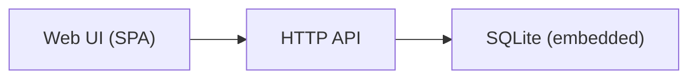

# Architecture: Todo Mini

> Status: Reviewed · Last updated: 2026-09-02
> Inputs: docs/srs.md v2 · docs/use-cases.md

## 1. Introduction and goals

A single-user task list. Quality drivers, in order: simplicity of operation
(CON-001), responsiveness (NFR-PERF-001), accessibility (NFR-A11Y-001).

## 5. Building block view

- **Web UI** — one surface, code WEB.
- **HTTP API** — REST, JSON envelope `{ data, error }`.
- **Store** — SQLite via the API's data layer.

## 8. Cross-cutting concepts

### Testing

- **Strategy:** unit tests on the domain layer, contract tests on the API,
  thin E2E on critical flows.
- **Critical flows covered by E2E:** UC-001 (add a task), UC-002 (complete a task).
- **Frameworks:** Vitest for unit and contract tests (API and UI); Playwright
  for E2E.
- **Coverage stance:** report-only, whole-repo. Driver: a one-person project;
  a gate would slow more than it protects.

### Configuration

Environments: staging → production. Config read from environment variables
via one typed loader per unit.

## 9. Architecture decisions

### ADR-001: Single container with embedded SQLite

- **Status:** Accepted
- **Context:** CON-001 mandates a single container; the data set is small.
- **Decision:** SQLite file inside the container volume; no separate database service.
- **Consequences:** Trivial operations; no horizontal scaling (accepted for v1).
- **Requirements addressed:** FR-TASK-001, FR-TASK-002, FR-TASK-004, NFR-PERF-001

### ADR-002: Design tokens as the single source of UI values

- **Status:** Accepted
- **Context:** NFR-A11Y-001 needs contrast guarantees that must not drift.
- **Decision:** All colours and spacing come from tokens.json via design.md; components never use raw values.
- **Consequences:** Accessibility checks happen once, at the token level.
- **Requirements addressed:** NFR-A11Y-001
