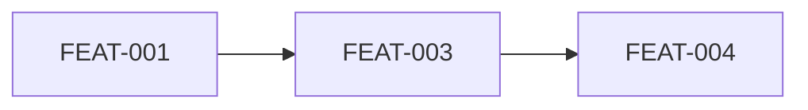

# Implementation Plan: Todo Mini

> Status: Reviewed · Last updated: 2026-09-16
> Inputs: docs/srs.md · docs/use-cases.md · docs/architecture.md · docs/ux-foundations.md

## Revision history

| Date | Change |
| :-- | :-- |
| 2026-09-05 | Initial reviewed plan |
| 2026-09-16 | FEAT-002 removed (completion deferred to v2 by the product owner); FR-TASK-002 consciously deferred — see §7 |

## 1. Overview
Vertical slices over one API and one screen set. Priority: fastest
demonstrable list, so the walking skeleton lands the list screen first.

## 2. Walking Skeleton
Container boots, API answers `GET /health`, the SPA renders SCR-WEB-001 empty
state from the design system. Done when a request flows end to end locally.

## 3. Epic & Feature Breakdown

### Epic: Tasks

| ID | Feature | Status | FRs | UCs | Screens | Blocks/Endpoints | Data |
| :- | :------ | :----- | :-- | :-- | :------ | :--------------- | :--- |
| FEAT-001 | Add a task | Active | FR-TASK-001, FR-TASK-006 | UC-001 | SCR-WEB-001, SCR-WEB-002 | API: POST /tasks | Task |
| FEAT-002 | ~~Complete a task~~ | Removed | — | — | — | — | — |
| FEAT-003 | List tasks | Active | FR-TASK-004 | UC-003 | SCR-WEB-001 | API: GET /tasks | Task |
| FEAT-004 | Archive a task | Active | FR-TASK-005 | UC-004 | SCR-WEB-003 | API: PATCH /tasks/{id}/archive | Task |

## 4. Build Sequence

1. FEAT-001 — Add a task (first slice; proves create path and validation)
2. ~~FEAT-002~~ — removed 2026-09-16; ID retained, never recycled
3. FEAT-003 — List tasks
4. FEAT-004 — Archive a task

## 5. First Vertical Slice
FEAT-001. Acceptance: a submitted title creates an open task at the top of the
list (FR-TASK-001); an empty title is rejected with an explanation (FR-TASK-006).
Screens: SCR-WEB-001, SCR-WEB-002. Contract: `POST /tasks`.

## 6. Engineering Foundations
Vitest (unit, contract), Playwright (E2E, flow UC-001), coverage report-only
per the architecture. Tokens wired into the SPA shell. Realizes NFR-PERF-001
and NFR-A11Y-001 at the foundations level.

## 7. Risks & Assumptions
Must-coverage check: FR-TASK-001, -004, -006 in a feature; NFRs in foundations.
**Open coverage gap:** FR-TASK-002 (Must) is consciously deferred to v2 by the
product owner's 2026-09-16 decision; requirements-engineering has been asked to
re-prioritize it. FR-TASK-003 is Removed and deliberately unplanned.
