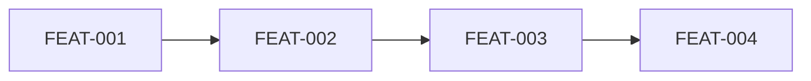

# Implementation Plan: Todo Mini

> Status: Reviewed · Last updated: 2026-09-15
> Inputs: docs/srs.md · docs/use-cases.md · docs/architecture.md · docs/ux-foundations.md

## 1. Overview
Four vertical slices over one API and one screen set. Priority: fastest
demonstrable list, so the walking skeleton lands the list screen first.

## 2. Walking Skeleton
Container boots, API answers `GET /health`, the SPA renders SCR-WEB-001 empty
state from the design system. Done when a request flows end to end locally.

## 3. Epic & Feature Breakdown

### Epic: Tasks

| ID | Feature | Status | FRs | UCs | Screens | Blocks/Endpoints | Data |
| :- | :------ | :----- | :-- | :-- | :------ | :--------------- | :--- |
| FEAT-001 | Add a task | Active | FR-TASK-001, FR-TASK-006 | UC-001 | SCR-WEB-001, SCR-WEB-002 | API: POST /tasks | Task |
| FEAT-002 | Complete a task | Active | FR-TASK-002 | UC-002 | SCR-WEB-001, SCR-WEB-003 | API: PATCH /tasks/{id}/complete | Task |
| FEAT-003 | List tasks | Active | FR-TASK-004, FR-TASK-099 | UC-003 | SCR-WEB-001 | API: GET /tasks | Task |
| FEAT-004 | Archive a task | Active | FR-TASK-005, FR-TASK-003 | UC-004 | SCR-WEB-003 | API: PATCH /tasks/{id}/archive | Task |

## 4. Build Sequence

1. FEAT-001 — Add a task (first slice; proves create path and validation)
2. FEAT-002 — Complete a task (depends on FEAT-001 data)
3. FEAT-003 — List tasks (ordering rules need done tasks to exist)
4. FEAT-004 — Archive a task (depends on FEAT-002)

## 5. First Vertical Slice
FEAT-001. Acceptance: a submitted title creates an open task at the top of the
list (FR-TASK-001); an empty title is rejected with an explanation (FR-TASK-006).
Screens: SCR-WEB-001, SCR-WEB-002. Contract: `POST /tasks`.

## 6. Engineering Foundations
Vitest (unit, contract), Playwright (E2E, flows UC-001 and UC-002), coverage
report-only per the architecture. Tokens wired into the SPA shell. Realizes
NFR-PERF-001 and NFR-A11Y-001 at the foundations level.

## 7. Risks & Assumptions
Must-coverage check: FR-TASK-001, -002, -004, -006 all in a feature; NFRs in
foundations.
